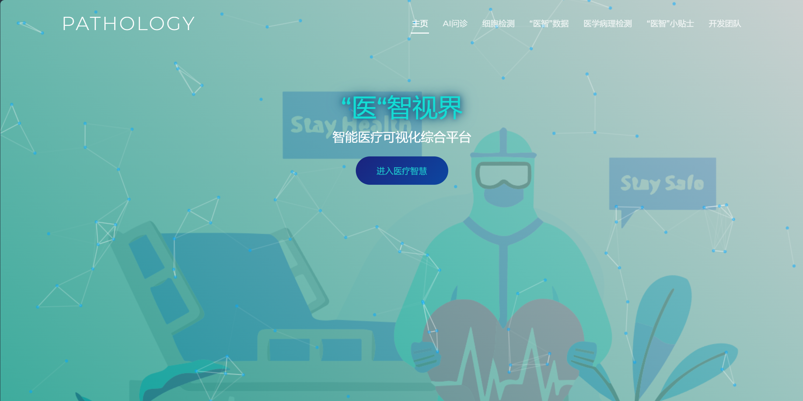
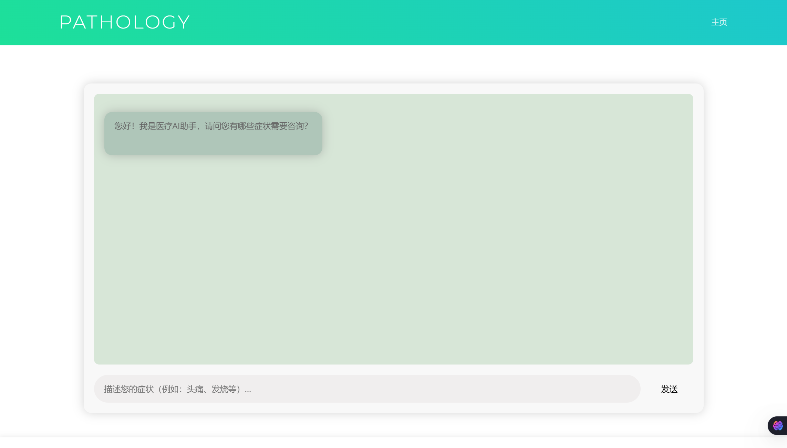
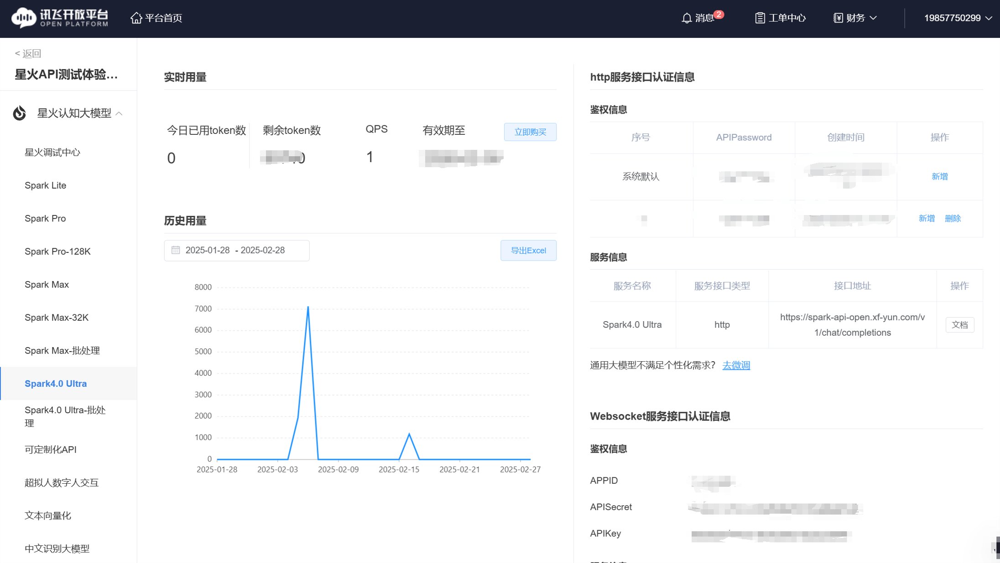
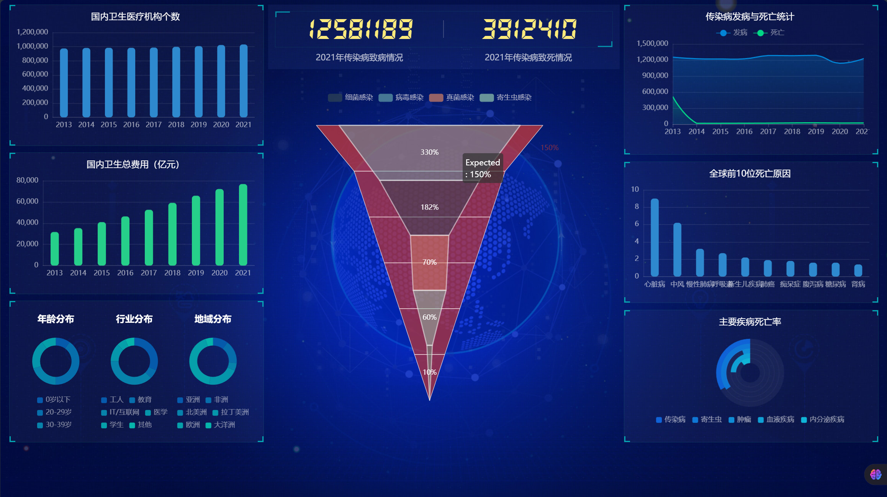
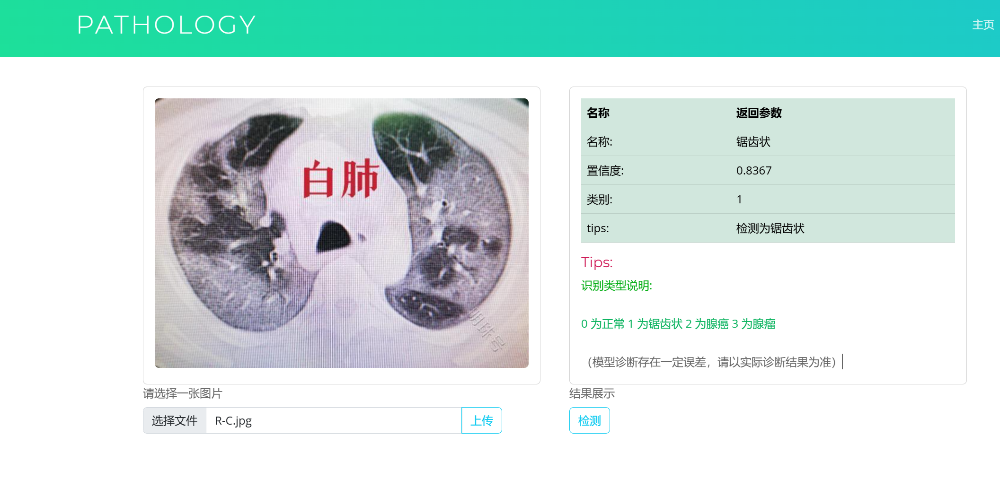

# medical-diagnosis

本系统针对医疗影像和电子病历数据，结合 目标检测、分类、自然语言分析、时序预测 等技术，提供 白肺检测、皮肤病分类、医学报告智能生成、疾病发展趋势预测等功能，并通过 ECharts 数据可视化 让医生和惠者更直观地查看数据。

## 主界面



## AI问诊



集成了讯飞星火的API，[控制台-讯飞开放平台](https://console.xfyun.cn/services/bm4)



将`epidemic/settings.py`中的

> ```
> "APPID": "",
> "API_KEY": "",
> "API_SECRET": "",
> ```

更改为自己的。

## 疾病大数据

基于echarts的数据统计，通过网络接口事实获取获取数据，利用python进行数据处理，将后端数据返回进行图表渲染



## 图像识别

基于yolo的图像识别，用于检测白肺

